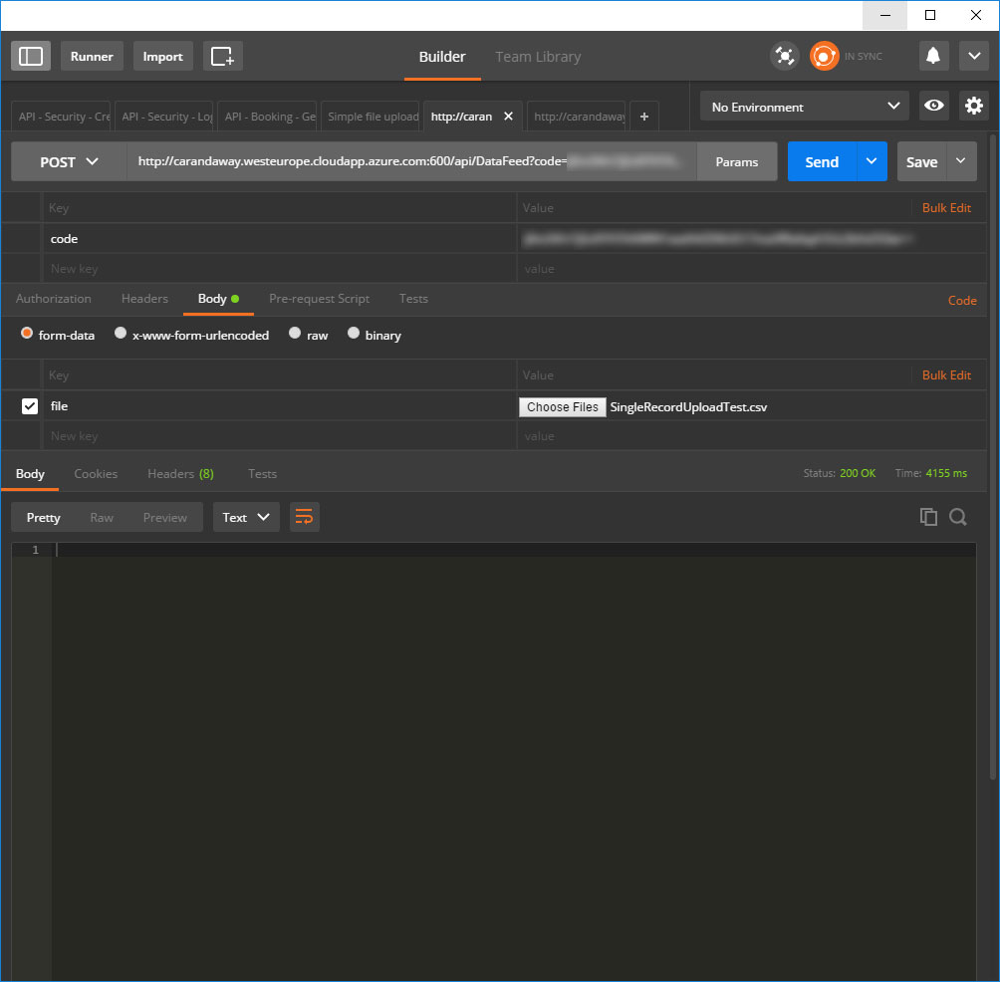

# Uploading to Car & Away
This document will explain how to upload files to the Car & Away system.

## Security
All calls to the API are monitored and only calls with a valid security token will be processed. Pass your token in as a 'code' query parameter.

## File format
The file you upload to the system must be a CSV file with the following fields:
- Booking_Ref
- Booking_Status
- Car_Park_Code
- Product_Name
- Car Care Extra
- Booking_Start_Date
- Booking_End_Date
- Reg_No
- Veh_Mfr
- Veh_Model
- Veh_Colour
- Flight_No_Out
- Booking_Start_Time
- Booking_End_Time
- Lead_Name
- Customer_Mobile
- Customer_Email
- Flight_No_In,Source_Reference
- Sms_Confirmation

The first line must be the field titles, after that each line of the file represents a single record to be inserted. Not every field is required but *Booking_start_date, Booking_end_date, reg_no, booking_start_time, booking_end_time, customer_email* are required.

You can [download the sample CSV file](SampleUpload.csv) to see what a valid upload file should look like.

## End Point
The end point for this service is **/api/DataFeed**. There is also a[ swagger definition file](swagger.json) if needed.

### Method
- POST

### Query string parameter:
- code : your secret token for accessing the system

### Form parameters
- File data : You only need to send in the file as form data for it to be processed

### Return code
- 200 (OK) : Means the file was processed successfully
- 401 (Unauthorised) : The security token was incorrect
- Anything else means there was a problem

## Development
You are free to call the development environment as much as you need.

The development environment URL is: <http://carandaway.westeurope.cloudapp.azure.com:600> and the DataFeed API is available here: <http://carandaway.westeurope.cloudapp.azure.com:600/api/DataFeed>

### Example
Here I am using a [chrome application called Postman](https://chrome.google.com/webstore/detail/postman/fhbjgbiflinjbdggehcddcbncdddomop?hl=en) to upload the example CSV file into the system.

- In the query parameters you can see I have passed in the secret token as the "code" query string parameter
- I am setting a single form field called "file" to be the file I want to upload
- I got a 200 (OK) response from the server to tell me the file processed successfully

## Troubleshooting
This is a very simple API call, the only real problem you can get is if the file isn't in the right format or your security token isn't valid.

But if there are problems please raise them as issues here in GitHub and we will deal with them.